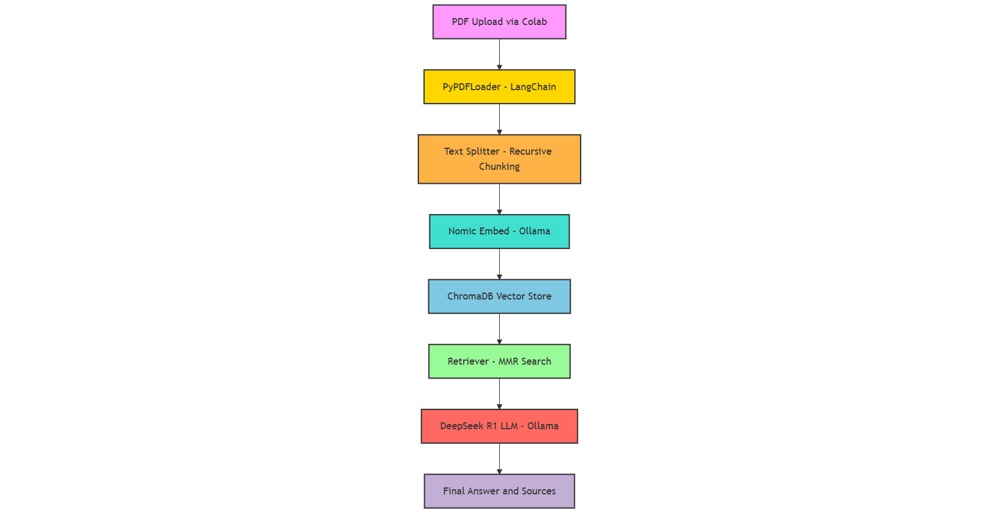

# 🧠 DocuSense: Retrieval-Augmented PDF QA System  
  
  
  
  

> A PDF Question Answering system using Retrieval-Augmented Generation (RAG) with LangChain, Ollama LLMs, and ChromaDB.

---

## 🚀 Overview

**DocuSense** is a smart PDF assistant built using LangChain, DeepSeek-R1 LLM (via Ollama), and ChromaDB. It leverages vector embeddings to retrieve and synthesize contextually relevant answers from uploaded documents in real-time.

---

## 🧰 Tech Stack

- **Python 3.10**
- **LangChain** (RetrievalQA + document loaders)
- **Ollama** with **DeepSeek-R1** for LLM inference
- **Nomic-Embed Text** for generating vector embeddings
- **ChromaDB** for semantic vector storage and fast retrieval
- **Google Colab** for notebook-based interactivity

---

## 🏗️ DocuSense Architecture

The following diagram illustrates the internal workflow of the DocuSense RAG system — from PDF ingestion to LLM-driven QA output:

